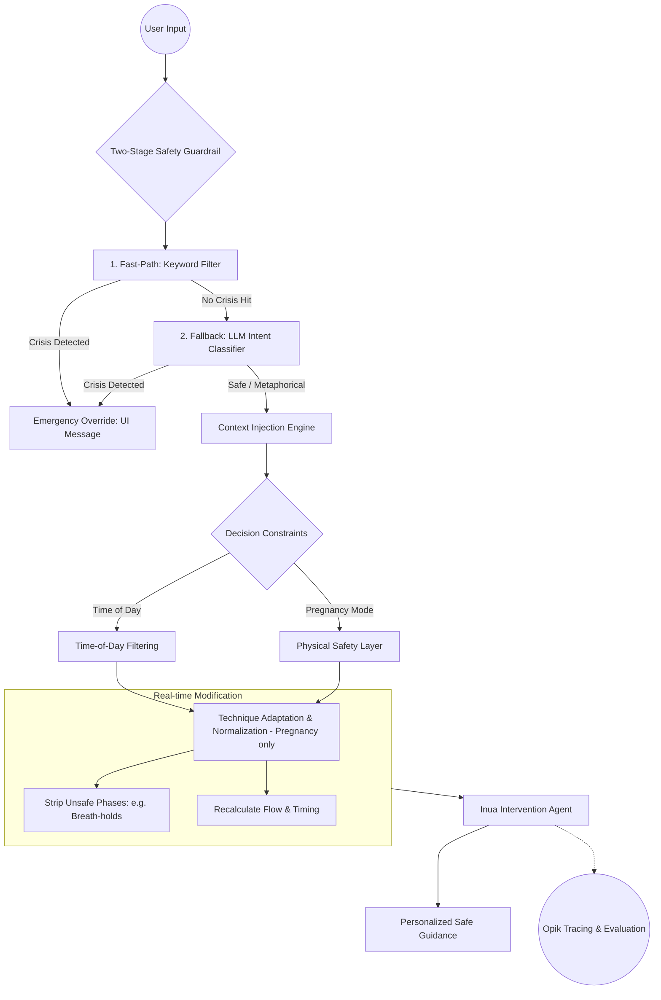

# Inua Decision Pipeline

```mermaid
graph TD
    A((User Input)) --> B{Two-Stage Safety Guardrail}
    
    %% Safety Layers (sequential fallback)
    B --> B1[1. Fast-Path: Keyword Filter]
    B1 -- No Crisis Hit --> B2[2. Fallback: LLM Intent Classifier]
    
    B1 -- Crisis Detected --> C[Emergency Override: UI Message]
    B2 -- Crisis Detected --> C
    B2 -- Safe / Metaphorical --> D[Context Injection Engine]
    
    %% Context Data
    D --> E{Decision Constraints}
    E -->|Time of Day| F[Time-of-Day Filtering]
    E -->|Pregnancy Mode| G[Physical Safety Layer]
    
    %% Adaptation (pregnancy-only)
    F & G --> H[Technique Adaptation & Normalization - Pregnancy only]
    subgraph Adaptation_Process [Real-time Modification]
        H --> H1[Strip Unsafe Phases: e.g. Breath-holds]
        H --> H2[Recalculate Flow & Timing]
    end
    
    %% Agent Final Output
    Adaptation_Process --> I[Inua Intervention Agent]
    I --> J[Personalized Safe Guidance]
    
    %% Observation (optional)
    I -.-> K((Opik Tracing & Evaluation))
```
